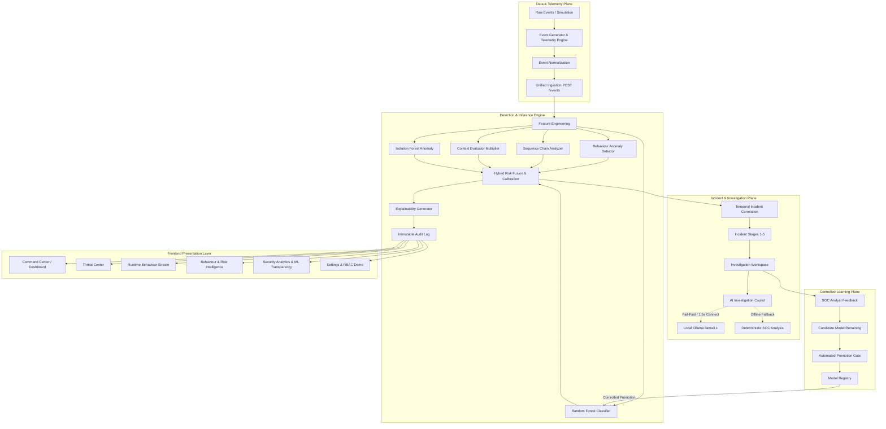

# SENTINEL — Technical Architecture & Preservation Guide

## 1. System Overview

**SENTINEL** (Continuous Privileged Trust Platform) is an explainable insider-threat detection and privileged-access misuse investigation platform built for security operations centers (SOC).

The fundamental architectural principle governing SENTINEL is:
> **"Authorized access does not necessarily mean authorized behaviour."**

Legacy systems rely solely on static perimeter controls (RBAC/ABAC). SENTINEL evaluates runtime events using multi-dimensional signals—behavioral baselines, temporal sequence chains, operational context, and machine learning anomaly detectors—fusing them into deterministic, bounded, and explainable risk scores.

---

## 2. High-Level Architecture Diagram



---

## 3. Backend Architecture

The backend is built with Python 3.12 and Flask, structured with strict package-level separation:

```text
backend/
├── app.py                     # Central Flask application and API route registry
├── processor.py               # Authoritative security event processor & risk fusion
├── data_loader.py             # In-memory thread-safe event, user, and context store
├── telemetry/
│   ├── event_generator.py     # Live event generation & lifecycle simulation
│   └── simulator.py           # Thread-safe background runner with bounded buffers
├── ml/
│   ├── predictor.py           # Real-time feature extraction and ML inference
│   ├── explainability.py      # Feature attribution & explainability generators
│   └── registry/
│       ├── model_registry.py  # Model lifecycle, versioning, rollback & promotion gates
│       └── feedback_store.py  # Analyst feedback collection & candidate dataset
├── llm/
│   ├── ollama_client.py       # Fail-fast local Ollama client with TTL health cache
│   └── prompts.py             # Grounded SOC narrative templates & sanitization
├── api/
│   ├── audit.py               # Audit log querying, filtering, and pagination
│   └── incidents.py           # Temporal incident correlation and stage tracking
├── tests/                     # Automated pytest validation suite (61 unit & integration tests)
└── requirements.txt           # Minimal pinned third-party dependencies
```

---

## 4. Frontend Architecture

The frontend is built using React 19, TypeScript, Tailwind CSS v4, and TanStack React Query:

```text
sentinel-frontend/src/
├── components/
│   ├── common/                # GlobalSearchModal, LoadingSkeleton, MetricCard
│   ├── dashboard/             # KpiCard, SimulationControlWidget, TrustLandscapeChart
│   ├── threats/               # ThreatCard, ThreatFilters, ThreatTable
│   ├── runtime/               # LiveStreamWidget, AttackChainVisualizer
│   ├── investigation/         # AICopilotCard, ResponseActionPanel, ContextPanel
│   ├── analytics/             # ModelRegistryPanel, FeatureWeightsChart
│   ├── layout/                # AppShell, TopHeader (Home link, search, notifications), Sidebar
│   └── auth/                  # ProtectedRoute, RBAC PermissionGate
├── context/
│   ├── AuthContext.tsx        # RBAC role switching (ADMIN, ANALYST, VIEWER)
│   ├── ThemeContext.tsx       # Dark/Light theme state with localStorage persistence
│   └── NotificationContext.tsx# Transient & persistent notification lifecycle
├── hooks/
│   ├── useSecurityData.ts     # React Query hooks with optimized staleTime & gcTime
│   └── usePolling.ts          # Centralized bounded live stream telemetry hook
├── pages/                     # Dashboard, ThreatCenter, RuntimeBehaviour, BehaviourRisk, Analytics, Investigation, Audit, Settings
├── services/                  # api.ts (Fetch HTTP client) and mockApi.ts (Demo fallback)
└── types/                     # Typed TypeScript interfaces for events, risks, incidents
```

---

## 5. Machine Learning Pipeline

1. **Feature Extraction**:
   - Converts raw event attributes (e.g. `event_type`, `volume`, `hour`, `is_weekend`, `is_new_device`, `peer_group_deviation`) into standard 12-dimensional numerical vectors.
2. **Hybrid Detection**:
   - **Random Forest**: Supervised probability scoring trained on historical abuse patterns.
   - **Isolation Forest**: Unsupervised anomaly detection identifying rare baseline deviations.
3. **Risk Fusion Formula**:
   $$\text{Raw Risk} = (\text{Behaviour Anomaly} \times 0.40) + (\text{Sequence Chain} \times 0.35) + (\text{ML Model} \times 0.25)$$
   $$\text{Final Risk} = \text{clamp}(\text{Raw Risk} \times \text{Context Multiplier}, 0, 100)$$
4. **Explainability**:
   - Provides human-interpretable signals (e.g., `UNUSUAL_VOLUME`, `AFTER_HOURS_ACCESS`, `PRIVILEGE_MISMATCH`) with explicit weights so analysts understand every score.

---

## 6. Telemetry & Simulation Pipeline

- **Thread Safety**: Uses Python `threading.Lock` across event buffers and lifecycle states (`idle`, `starting`, `running`, `paused`, `stopped`).
- **Bounded Buffer**: Maintains a circular buffer of the last 1,000 processed telemetry events to prevent memory leaks during long-running live demonstrations.
- **Unified Ingestion**: External systems and the simulation engine both submit events through `POST /events`, ensuring identical normalization and risk scoring.

---

## 7. AI Investigation Copilot (Local Ollama & Fallback)

- **Role**: The AI Copilot serves strictly as an **investigation assistant**, never as the primary detection authority.
- **Fail-Fast Policy**:
  - Connection timeout: **1.5 seconds**.
  - Generation read timeout: **6.0 seconds**.
- **Cached Health Checks**: `GET /api/llm/status` polls Ollama with a 15-second in-memory TTL to prevent redundant network pings.
- **Zero-Downtime Deterministic Fallback**:
  - If Ollama is offline or times out, the Copilot instantly renders the **Deterministic Investigation Analysis**, displaying multi-layer risk signals, contributing factors, and recommended SOC actions with 0ms hang.

---

## 8. Role-Based Access Control (RBAC)

SENTINEL implements clear role segregation:

| Capability | ADMIN | SOC_ANALYST | VIEWER |
| :--- | :---: | :---: | :---: |
| View Security Posture & Dashboard | ✅ | ✅ | ✅ |
| View Threat Center & Telemetry Stream | ✅ | ✅ | ✅ |
| Investigate Security Incidents | ✅ | ✅ | 🔍 (Read-Only) |
| AI Investigation Copilot Analysis | ✅ | ✅ | ❌ |
| Execute Response Actions (e.g., Revoke Token) | ✅ | ✅ | ❌ |
| Manage ML Model Promotion / Rollback | ✅ | ❌ | ❌ |
| Inject Live Simulation Events | ✅ | ❌ | ❌ |

---

## 9. Security & Ground-Truth Isolation

- **Zero Ground Truth in Runtime**: Ground truth labels (`ground_truth.csv`) are strictly segregated to training/benchmarking routines. Runtime inference functions (`process_event()`, `predict_risk()`) operate solely on real-time event attributes.
- **Data Egress Prevention**: All LLM prompts are sanitized, stripped of private credentials, and processed strictly on localhost (`http://localhost:11434`).
- **Input Sanitization**: Ingestion endpoints validate required fields and enforce bounding constraints ($0 \le \text{risk} \le 100$).

---

## 10. Verification & CI/CD Pipeline

Every pull request and push to `main` and `integration` triggers automated GitHub Actions:

```text
GitHub Actions Runner (Linux / Python 3.12 & Node 22)
  ├── 1. Install Dependencies (pip + npm ci)
  ├── 2. Backend Unit & Integration Tests (pytest backend/tests -v) [61/61 PASSED]
  ├── 3. Python Bytecode Compilation (compileall -q backend)
  ├── 4. Frontend Lint (oxlint) [0 Errors]
  ├── 5. Frontend Production Build (tsc -b && vite build)
  └── 6. Frontend Mock Mode Build (VITE_USE_MOCK_DATA=true)
```

---

## 11. Known Limitations & Future Roadmap

1. **In-Memory Store**: Currently uses an in-memory repository suitable for prototypes and SIH demonstrations. Future enterprise versions can attach SQLite/PostgreSQL by implementing the `AbstractEventStore` interface.
2. **Identity Provider Integration**: Role-based access control uses client-side demo profiles. Future versions will integrate OIDC/SAML/OAuth2 identity providers.
3. **Distributed Streaming**: Live telemetry currently utilizes HTTP polling and Server-Sent Events. High-throughput deployments can hook Apache Kafka or Redis Streams into `backend/telemetry/`.
