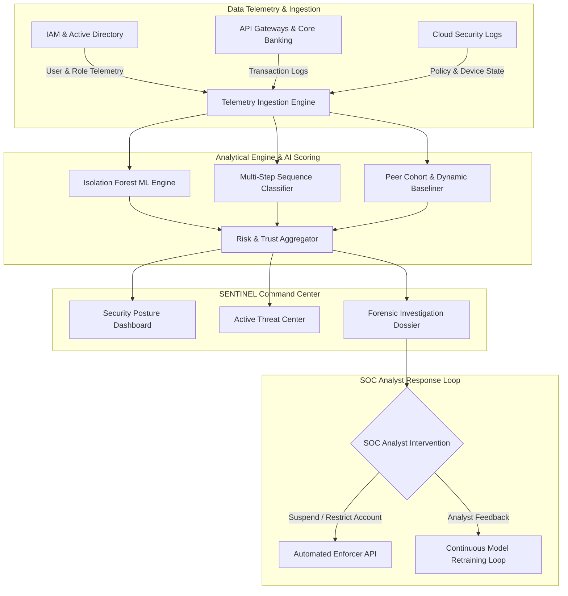

# 🛡️ SENTINEL | Continuous Behavioural Trust & Insider Threat Intelligence

> **VIT CHENNAI CSI ORIGINS HACKATHON — PROBLEM STATEMENT 9**  
> *Continuous Trust Evaluation & Explainable Behavioural Telemetry for Privileged Entities*

---

## 📌 Executive Summary & Core Paradigm

Traditional enterprise security relies on **perimeter security and point-in-time authentication** (MFA, SSO, Password Validation). However, once an identity passes authentication, standard access control systems treat them as fully trusted — exposing organizations to critical **insider threats, credential theft, session hijacking, and lateral movement**.

**SENTINEL** introduces a paradigm shift: **`Authenticated ≠ Trusted`**.

SENTINEL is an enterprise-grade SOC (Security Operations Center) telemetry and forensic intelligence platform that continuously evaluates the behavioural trust score of privileged identities in real time. Using explainable machine learning models (Isolation Forest algorithms, dynamic baselining, and peer cohort analysis), SENTINEL detects subtle multi-step sequence anomalies and empowers SOC analysts to enforce real-time remediation.

---

## 🚀 Key Unique Selling Points (USPs) & Core Features

| USP # | Feature Module | Core Value & Capability |
|---|---|---|
| **USP 1** | **Continuous Trust Scoring** | Moves beyond static logins. Re-calculates trust score (0–100) on every action, API call, and financial transaction. |
| **USP 2** | **Multi-Step Behaviour Sequence Tracking** | Analyzes ordered chains of events (e.g., *Privilege Escalation ➔ Beneficiary Creation ➔ Rate Override ➔ Wire Transfer*) rather than isolated log events. |
| **USP 3** | **Dynamic Baseline & Peer Analysis** | Compares entity metrics against their own 30-day historical baseline and peer department cohorts to flag statistical outliers. |
| **USP 4** | **Context-Aware Business Intent Scoring** | Evaluates active maintenance windows, emergency change tickets, time-of-day, and authorized business exceptions. |
| **USP 5** | **Relationship Graph Telemetry** | Renders interactive node-link network topologies mapping entity relationships across devices, accounts, beneficiaries, and resource nodes. |
| **USP 6** | **Explainable Risk Decomposition** | Provides granular risk factor breakdowns (Financial, Timing, Device, Access, Sequence, Privilege) powered by Isolation Forest scoring. |
| **USP 7** | **Active Response & RLHF Feedback** | Instant execution of SOC actions (`MONITOR`, `VERIFY`, `RESTRICT`, `SUSPEND`, `ESCALATE`) paired with continuous analyst feedback loops. |

---

## 🏗️ System Architecture & Workflow



---

## 🛠️ Technology Stack

- **Frontend Core:** React 19, TypeScript 5.x, Vite 8
- **Styling & UI System:** Tailwind CSS v4, Custom Dark Financial/SOC Theme (`--snt-*` CSS Variable Design System)
- **Icons & Visuals:** Lucide React, Recharts (Trust Landscape & Severity Analytics), Framer Motion (Real-time Live Stream animations)
- **Data State Management:** TanStack React Query v5 (Optimistic updates, refetching intervals, cached queries)
- **API & Mock Layer:** Dual API Architecture (`mockApiService` for standalone presentation / `apiService` for REST backend integration controlled via `VITE_USE_MOCK_DATA`)

---

## 📁 Repository Structure

```
vitcsiorigins/
├── sentinel-frontend/
│   ├── public/
│   ├── src/
│   │   ├── assets/              # Branding assets & SVG logos
│   │   ├── components/
│   │   │   ├── analytics/       # Model stats & anomaly distribution charts
│   │   │   ├── audit/           # Audit trail table components
│   │   │   ├── common/          # Reusable UI elements (Badge, Button, Card, Modal)
│   │   │   ├── dashboard/       # KPI cards, Trust Landscape chart, Live Stream
│   │   │   ├── identities/      # Directory listing table & filters
│   │   │   ├── investigation/   # Forensic dossier components (Graph, Timeline, Peer Analysis)
│   │   │   ├── layout/          # AppShell, Sidebar, TopHeader navigation
│   │   │   └── threats/         # Severity filter cards & threat list
│   │   ├── data/
│   │   │   └── mockData.ts      # Comprehensive SOC mock datasets & threat scenarios
│   │   ├── hooks/
│   │   │   └── useSecurityData.ts # Custom React Query hooks (Dashboard, Threats, Forensic, Audit)
│   │   ├── pages/
│   │   │   ├── Analytics.tsx    # Security Analytics & Model Health page
│   │   │   ├── Audit.tsx        # Response Log & Compliance Audit page
│   │   │   ├── Dashboard.tsx    # Command Center Security Posture Overview
│   │   │   ├── Identities.tsx   # Monitored Privileged Identities Directory
│   │   │   ├── Investigation.tsx# Forensic Deep-Dive Dossier page
│   │   │   ├── Login.tsx        # Analyst Access Portal
│   │   │   ├── Settings.tsx     # System Configuration & Threshold controls
│   │   │   └── ThreatCenter.tsx # Active Threats & Anomaly Center
│   │   ├── services/
│   │   │   ├── api.ts           # Production REST API Service client
│   │   │   ├── mockApi.ts       # Mock API service engine with simulated network latencies
│   │   │   └── index.ts         # Service switcher logic
│   │   ├── types/
│   │   │   └── security.ts      # TypeScript interfaces for all domain models
│   │   ├── utils/
│   │   │   └── formatters.ts    # Financial currency, risk color mappings, and helper utilities
│   │   ├── App.tsx              # React Router v7 routes & layout configuration
│   │   ├── index.css            # Core design system CSS variables & utilities
│   │   └── main.tsx             # Application root entry point
│   ├── package.json
│   ├── tsconfig.json
│   └── vite.config.ts
└── README.md
```

---

## 💻 Getting Started Locally

### Prerequisites
- **Node.js**: v18.x or higher
- **npm**: v9.x or higher

### Installation Steps

1. **Clone the repository:**
   ```bash
   git clone https://github.com/muthukkumaranb/vitcsiorigins.git
   cd vitcsiorigins/sentinel-frontend
   ```

2. **Install dependencies:**
   ```bash
   npm install
   ```

3. **Start the local development server:**
   ```bash
   npm run dev
   ```
   The application will be accessible at **`http://localhost:3000/`** (or `http://localhost:5173/`).

4. **Build for production:**
   ```bash
   npm run build
   ```

5. **Type check with TypeScript:**
   ```bash
   npx tsc --noEmit
   ```

---

## 📊 Application Dashboard & Key Screens

1. **Security Posture Dashboard (`/dashboard`)**
   - High-level KPI metrics (Total Identities, Trust Score, Active Threats, Events Scored).
   - Trust Landscape timeline graph showing overall ecosystem risk drift over time.
   - Real-time animated live behaviour telemetry stream.

2. **Active Threat Center (`/threats`)**
   - Categorized threat queues by severity (`CRITICAL`, `HIGH`, `MEDIUM`, `LOW`).
   - One-click navigation to forensic dossiers.

3. **Forensic Investigation Dossier (`/investigation/:userId`)**
   - **Explainable Risk Decomposition**: Visual bar chart breakdown of anomaly contributions.
   - **Behaviour Sequence Timeline**: Chronological event flow with risk level indicators.
   - **Peer & Baseline Metrics**: Comparative table showing deviation percentages.
   - **Relationship Topology Graph**: Interactive force-directed network graph.
   - **Action Control Dock**: Fixed enforcement panel for immediate analyst response.

4. **Audit & Response Center (`/audit`)**
   - Immutable audit logs capturing every automated action and SOC analyst decision.

---

## 📜 License & Acknowledgments

Developed for **VIT CHENNAI CSI ORIGINS HACKATHON 2026** (Problem Statement 9).  
Designed with modern SOC usability standards and zero-trust security paradigms.