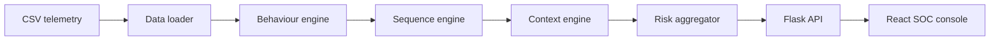

# SENTINEL
### Privileged Access Misuse & Insider Threat Detection

SENTINEL is a deterministic cybersecurity MVP that compares privileged activity with user baselines, correlates suspicious action sequences, evaluates approved operational context, and presents explainable risk assessments to security analysts.

## Problem Statement

CSI ORIGIN 2026 Problem Statement 9, provided in [Problem_Statement_9.pdf](Problem_Statement_9.pdf), focuses on a gap in traditional access control: a valid identity may perform a valid action in an invalid behavioral pattern. SENTINEL addresses that gap without treating anomaly as proof of malicious intent.

## Solution

```text
Behaviour deviation + Sequence correlation + Context evaluation
                              |
                     Explainable risk assessment
```

The core principle is: **authorized access does not necessarily mean authorized behaviour.**

## Key Capabilities

- Baseline-aware behavior signals for timing, device, sensitive access, data volume, privilege, beneficiary, transaction, and frequency.
- Ordered sequence detection over a strict 60-minute prior-event lookback.
- Approved-context matching by user and inclusive time window, with a deliberate `0.8` MVP multiplier.
- Centralized bounded risk aggregation and severity classification.
- API-driven alerts, identities, and event investigation.
- React/TypeScript SOC console with explicit mock mode.

## Architecture



```text
Runtime CSV output
      |
Data loader -> Behaviour -> Sequence -> Context -> Risk
      |
Alert / investigation API
      |
React dashboard and investigation view
```

See [docs/architecture.md](docs/architecture.md) for the request and data flow.

## Detection Pipeline

`output/users.csv` supplies identity and baseline fields. `output/events.csv` supplies telemetry. Behavior scoring emits structured signals. Sequence scoring matches `UNUSUAL_LOGIN -> SENSITIVE_ACCESS -> PRIVILEGE_CHANGE -> BENEFICIARY_CHANGE -> LARGE_TRANSACTION -> DATA_EXPORT` using only earlier events within 60 minutes. Context matching requires `event.user_id == context.related_user_id` and an inclusive timestamp range. Approved context applies `0.8`; missing or ambiguous context does not suppress risk.

## Risk Model

```text
risk_score = clamp((behaviour_score * 0.6 + sequence_score * 0.4)
                   * context_multiplier, 0, 100)
```

Severity thresholds: `LOW` 0-24, `MODERATE` 25-49, `HIGH` 50-74, `CRITICAL` 75-100. All scores are finite and bounded.

## API

- `GET /api/health`: service and loaded event/user/context counts.
- `GET /api/alerts`: calculated high-risk alerts sorted by score.
- `GET /api/identities`: identities from the runtime user CSV.
- `GET /api/events/{event_id}/risk/`: public event, behavior, sequence, context, risk, severity, and explanations.

Missing events return HTTP 404 with a structured JSON error. See [docs/api.md](docs/api.md).

## Demo Scenarios

- `E0412`: normal authorized activity, risk `6.67`, `LOW`.
- `E0408`: suspicious six-stage sequence, risk `55.0`, `HIGH`, complete chain detected.
- `E0402`: suspicious activity under approved context, risk `22.67`, `LOW`, multiplier `0.8`.
- `E999999`: nonexistent event, HTTP `404`.

These values come from the checked-in generated output and current engine, not frontend constants.

## Repository Structure

```text
backend/                 Flask API, loader, detection engine, tests
sentinel-frontend/       React/Vite console and explicit mock fixtures
data/                    Source dataset snapshot and evaluation labels
output/                  Runtime/demo CSVs consumed by Flask
scripts/                 Offline generation and batch analysis
docs/                    Architecture, API, security, development, testing, roadmap
.github/workflows/       Reproducible CI
```

## Quick Start

Backend from the repository root:

```powershell
python -m pip install -r backend/requirements.txt
python -m backend.app
```

Frontend in a second terminal:

```powershell
cd sentinel-frontend
npm ci
npm run dev
```

Copy `sentinel-frontend/.env.example` to `.env`. Use `VITE_USE_MOCK_DATA=false` and `VITE_API_BASE_URL=http://127.0.0.1:5000` for live Flask mode. Mock mode is opt-in with `VITE_USE_MOCK_DATA=true`. Production API failures remain visible errors and never fall back to fixtures.

## Testing

```powershell
python -m pytest backend/tests -v
cd sentinel-frontend
npm ci
npm run build
npm run lint
```

GitHub Actions runs the backend tests/compilation and frontend `npm ci`, build, and lint. See [docs/testing.md](docs/testing.md).

## Data Integrity and Security

Runtime inference reads only users, events, and contexts. `data/ground_truth.csv` and `output/ground_truth.csv` are evaluation-only. No future event influences a current sequence result. Risk values are clamped, CORS is restricted to documented local origins, debug mode is disabled, and environment files/caches/build artifacts are ignored.

## Current Scope and Future Work

Implemented: deterministic behavioral deviation, sequence correlation, context adjustment, explainable risk, alerts, identity listing, event investigation, and API-backed frontend views.

Future extensions: persistent storage, authentication, persistent audit and analyst feedback, advanced ML modeling, continuous learning, automated response enforcement, immutable audit storage, and production streaming infrastructure.

See [docs/roadmap.md](docs/roadmap.md) for the staged roadmap.

## Contributing and Issues

Keep scoring changes covered by focused tests, preserve the public API contract, and document any dataset or behavior change. For an issue, include the command, environment, event ID, expected behavior, and observed response without attaching secrets or sensitive telemetry.

## Team

Team names are not present in the repository. Please replace the placeholders with the official team details:

| Name | Role | Responsibility |
|------|------|----------------|
| TBD | Team Lead / Architect | Solution direction |
| TBD | Backend Engineer | Flask API and data flow |
| TBD | Detection Engineer | Behavior and sequence rules |
| TBD | Frontend Engineer | React SOC console |
| TBD | Data Engineer | Dataset and evaluation |
| TBD | DevSecOps | CI and repository quality |

## License

No license file is currently present. Add the competition-approved license before public distribution.
