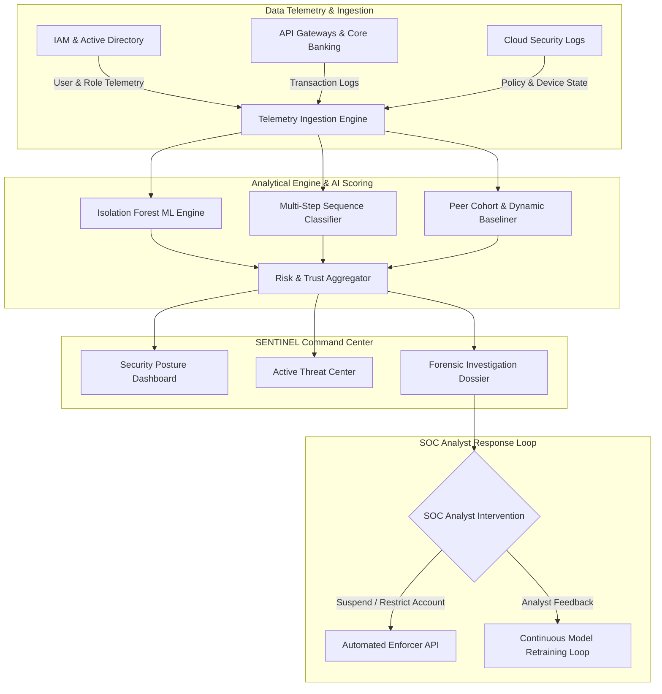

# 🛡️ SENTINEL | Continuous Behavioural Trust & Insider Threat Intelligence

> **VIT CHENNAI CSI ORIGINS HACKATHON — PROBLEM STATEMENT 9**  
> *Continuous Trust Evaluation & Explainable Behavioural Telemetry for Privileged Entities*

---

## 📌 Executive Summary & Core Paradigm

Traditional enterprise security relies on **perimeter security and point-in-time authentication** (MFA, SSO, Password Validation). However, once an identity passes authentication, standard access control systems treat them as fully trusted — exposing organizations to critical **insider threats, credential theft, session hijacking, and lateral movement**.

**SENTINEL** introduces a paradigm shift: **`Authenticated ≠ Trusted`**.

SENTINEL is an enterprise-grade SOC (Security Operations Center) telemetry and forensic intelligence platform that continuously evaluates the behavioural trust score of privileged identities in real time. Using explainable machine learning models (Isolation Forest algorithms, dynamic baselining, and peer cohort analysis), SENTINEL detects subtle multi-step sequence anomalies and empowers SOC analysts to enforce real-time remediation.

---

## 🚀 Key Unique Selling Points (USPs) & Core Features

| USP # | Feature Module | Core Value & Capability |
|---|---|---|
| **USP 1** | **Continuous Trust Scoring** | Moves beyond static logins. Re-calculates trust score (0–100) on every action, API call, and financial transaction. |
| **USP 2** | **Multi-Step Behaviour Sequence Tracking** | Analyzes ordered chains of events (e.g., *Privilege Escalation ➔ Beneficiary Creation ➔ Rate Override ➔ Wire Transfer*) rather than isolated log events. |
| **USP 3** | **Dynamic Baseline & Peer Analysis** | Compares entity metrics against their own 30-day historical baseline and peer department cohorts to flag statistical outliers. |
| **USP 4** | **Context-Aware Business Intent Scoring** | Evaluates active maintenance windows, emergency change tickets, time-of-day, and authorized business exceptions. |
| **USP 5** | **Relationship Graph Telemetry** | Renders interactive node-link network topologies mapping entity relationships across devices, accounts, beneficiaries, and resource nodes. |
| **USP 6** | **Explainable Risk Decomposition** | Provides granular risk factor breakdowns (Financial, Timing, Device, Access, Sequence, Privilege) powered by Isolation Forest scoring. |
| **USP 7** | **Active Response & RLHF Feedback** | Instant execution of SOC actions (`MONITOR`, `VERIFY`, `RESTRICT`, `SUSPEND`, `ESCALATE`) paired with continuous analyst feedback loops. |

---

## 🏗️ System Architecture & Workflow



---

## 🛠️ Technology Stack

- **Frontend Core:** React 19, TypeScript 5.x, Vite 8
- **Styling & UI System:** Tailwind CSS v4, Custom Dark Financial/SOC Theme (`--snt-*` CSS Variable Design System)
- **Icons & Visuals:** Lucide React, Recharts (Trust Landscape & Severity Analytics), Framer Motion (Real-time Live Stream animations)
- **Data State Management:** TanStack React Query v5 (Optimistic updates, refetching intervals, cached queries)
- **API & Mock Layer:** Dual API Architecture (`mockApiService` for standalone presentation / `apiService` for REST backend integration controlled via `VITE_USE_MOCK_DATA`)

---

## 💻 Getting Started Locally

### Installation & Run

1. **Install dependencies:**
   ```bash
   npm install
   ```

2. **Start the local development server:**
   ```bash
   npm run dev
   ```
   The application will be accessible at **`http://localhost:3000/`**.

3. **Build for production:**
   ```bash
   npm run build
   ```

4. **Type check with TypeScript:**
   ```bash
   npx tsc --noEmit
   ```
